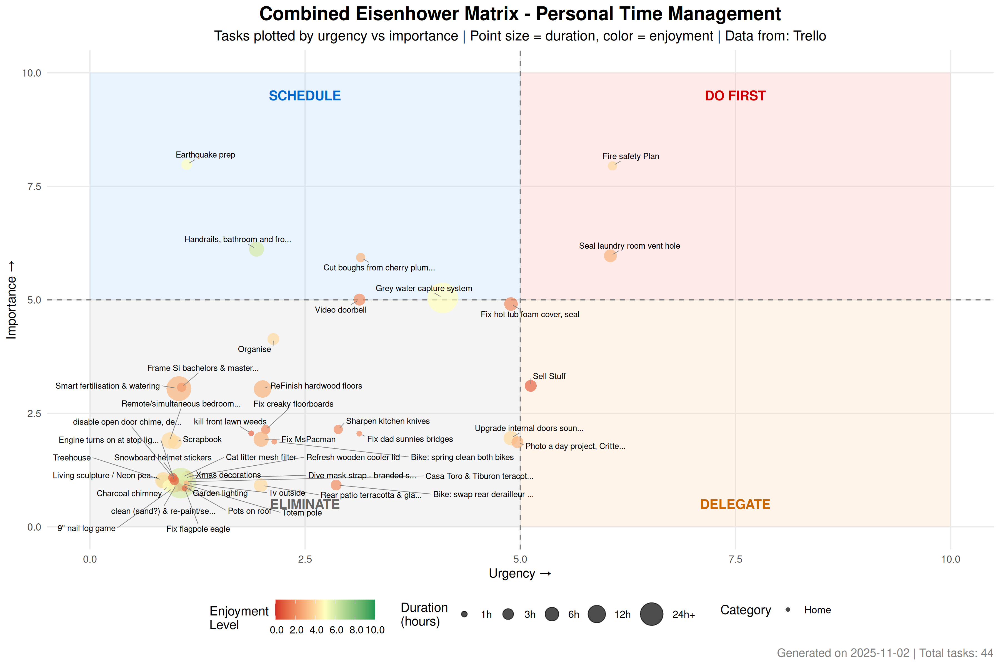

```{r setup, include=FALSE}
knitr::opts_chunk$set(
  echo = FALSE, 
  message = FALSE, 
  warning = FALSE,
  fig.align = 'center'
)

# Load required libraries
library(ggplot2)
library(dplyr)
library(knitr)
library(DT)

# Load data from saved RDS files
combined_task_data <- readRDS("combined_task_data.rds")
summary_statistics <- readRDS("summary_statistics.rds")

# Source visualization functions to recreate plots
source("../R/visualization.R")

# Separate work and home data
if (nrow(combined_task_data) > 0 && "category" %in% colnames(combined_task_data)) {
  work_task_data <- combined_task_data %>% filter(category == "Work")
  home_task_data <- combined_task_data %>% filter(category == "Home")
} else {
  work_task_data <- data.frame()
  home_task_data <- combined_task_data
}

# Recreate plots
eisenhower_plot <- create_eisenhower_plot(
  combined_task_data,
  title = "Combined Eisenhower Matrix - Personal Time Management"
)

work_eisenhower_plot <- if(nrow(work_task_data) > 0) {
  create_eisenhower_plot(work_task_data, title = "Work Eisenhower Matrix - Marine Calendar & MarSci Projects")
} else NULL

home_eisenhower_plot <- if(nrow(home_task_data) > 0) {
  create_eisenhower_plot(home_task_data, title = "Home Eisenhower Matrix - Admin Calendar & Meg & Si Todo")  
} else NULL

timeline_plot <- create_timeline_plot(combined_task_data)
work_timeline_plot <- if(nrow(work_task_data) > 0) create_timeline_plot(work_task_data) else NULL
home_timeline_plot <- if(nrow(home_task_data) > 0) create_timeline_plot(home_task_data) else NULL
```

# Overall

## Executive Summary

This dashboard provides an automated analysis of your personal task management using the Eisenhower Matrix approach. Tasks are plotted by urgency (x-axis) vs importance (y-axis), with point size representing duration and color representing enjoyment level.

## Key Metrics

```{r overall-summary-stats}
if (length(summary_statistics) > 0 && !is.null(summary_statistics$overall)) {
  # Create combined metrics table with Home/Work columns
  if (nrow(combined_task_data) > 0 && "category" %in% colnames(combined_task_data)) {
    
    overall_stats <- summary_statistics$overall
    
    # Calculate work stats
    work_stats <- if(nrow(work_task_data) > 0) {
      c(
        nrow(work_task_data),
        round(mean(work_task_data$urgency_final, na.rm = TRUE), 1),
        round(mean(work_task_data$importance_final, na.rm = TRUE), 1), 
        round(sum(work_task_data$duration_final, na.rm = TRUE), 1),
        round(mean(work_task_data$enjoyment_final, na.rm = TRUE), 1)
      )
    } else {
      c(0, 0, 0, 0, 0)
    }
    
    # Calculate home stats  
    home_stats <- if(nrow(home_task_data) > 0) {
      c(
        nrow(home_task_data),
        round(mean(home_task_data$urgency_final, na.rm = TRUE), 1),
        round(mean(home_task_data$importance_final, na.rm = TRUE), 1),
        round(sum(home_task_data$duration_final, na.rm = TRUE), 1), 
        round(mean(home_task_data$enjoyment_final, na.rm = TRUE), 1)
      )
    } else {
      c(0, 0, 0, 0, 0)
    }
    
    metrics_table <- data.frame(
      Metric = c("Total Tasks", "Average Urgency", "Average Importance", "Total Hours", "Average Enjoyment"),
      Home = home_stats,
      Work = work_stats
    )
    
    kable(metrics_table, caption = "Key Metrics by Category")
    
  } else {
    kable(summary_statistics$overall, 
          caption = "Overall Task Statistics",
          col.names = c("Metric", "Value"))
  }
} else {
  cat("No summary statistics available")
}
```

## Data Sources

```{r overall-data-sources}
if (nrow(combined_task_data) > 0) {
  source_summary <- combined_task_data %>%
    group_by(source) %>%
    summarise(
      Tasks = n(),
      `Avg Urgency` = round(mean(urgency_final, na.rm = TRUE), 1),
      `Avg Importance` = round(mean(importance_final, na.rm = TRUE), 1),
      `Total Hours` = round(sum(duration_final, na.rm = TRUE), 1),
      .groups = "drop"
    )
  
  kable(source_summary, caption = "Data by Source")
} else {
  cat("No data available from any sources")
}
```

## Combined Eisenhower Matrix

The main visualization shows all tasks plotted on the classic Eisenhower Matrix:

- **Do First (Red)**: Urgent and Important
- **Schedule (Blue)**: Important but Not Urgent  
- **Delegate (Orange)**: Urgent but Not Important
- **Eliminate (Gray)**: Neither Urgent nor Important

```{r combined-matrix, results='asis', echo=FALSE, comment=""}
writeLines('')
```

## Combined Quadrant Analysis

```{r combined-quadrant-analysis}
if (length(summary_statistics) > 0 && !is.null(summary_statistics$by_quadrant)) {
  quadrant_data <- summary_statistics$by_quadrant %>%
    arrange(desc(count)) %>%
    mutate(
      `% of Tasks` = round(100 * count / sum(count), 1)
    )
  
  kable(quadrant_data, 
        caption = "Task Distribution by Eisenhower Quadrant",
        col.names = c("Quadrant", "Count", "Avg Duration", "Total Duration", "Avg Enjoyment", "% of Tasks"))
} else {
  cat("No quadrant analysis available")
}
```

## Combined Timeline View

This view shows tasks over time based on their due dates:

```{r combined-timeline, results='asis', echo=FALSE, comment=""}
writeLines('')
```

## Combined Task List

```{r combined-task-table}
if (nrow(combined_task_data) > 0) {
  task_display <- combined_task_data %>%
    select(
      Category = category,
      Source = source,
      Task = task_title,
      Urgency = urgency_final,
      Importance = importance_final, 
      Enjoyment = enjoyment_final,
      Duration = duration_final,
      Quadrant = quadrant,
      Status = status,
      Project = project_context
    ) %>%
    arrange(desc(Urgency), desc(Importance))
  
  datatable(
    task_display,
    caption = "Complete Task List",
    options = list(
      pageLength = 15,
      scrollX = TRUE,
      columnDefs = list(
        list(className = 'dt-center', targets = c(3, 4, 5, 6))
      )
    ),
    filter = 'top'
  ) %>%
    formatRound(columns = c("Urgency", "Importance", "Enjoyment", "Duration"), digits = 1)
} else {
  cat("No tasks available to display")
}
```

## Combined Recommendations

```{r combined-recommendations}
if (nrow(combined_task_data) > 0) {
  
  # Calculate some insights
  do_first <- combined_task_data %>% 
    filter(urgency_final >= 5 & importance_final >= 5) %>% 
    nrow()
  
  eliminate <- combined_task_data %>% 
    filter(urgency_final < 5 & importance_final < 5) %>% 
    nrow()
  
  avg_enjoyment_by_quadrant <- combined_task_data %>%
    group_by(quadrant) %>%
    summarise(avg_enjoy = mean(enjoyment_final, na.rm = TRUE), .groups = "drop") %>%
    arrange(desc(avg_enjoy))
  
  total_hours <- sum(combined_task_data$duration_final, na.rm = TRUE)
  
  cat("### Key Insights\n\n")
  
  cat("- **High Priority Tasks**: You have", do_first, "tasks in the 'Do First' quadrant\n")
  cat("- **Potential Elimination**: Consider reviewing", eliminate, "tasks in the 'Eliminate' quadrant\n") 
  cat("- **Total Workload**: Approximately", round(total_hours, 1), "hours of work identified\n")
  
  if (nrow(avg_enjoyment_by_quadrant) > 0) {
    best_quadrant <- avg_enjoyment_by_quadrant$quadrant[1]
    cat("- **Highest Enjoyment**: Tasks in", best_quadrant, "have the highest average enjoyment rating\n")
  }
  
  cat("\n### Action Items\n\n")
  cat("1. Focus on 'Do First' quadrant tasks with high urgency and importance\n")
  cat("2. Schedule dedicated time for 'Schedule' quadrant tasks to prevent them becoming urgent\n") 
  cat("3. Consider delegating or automating tasks in the 'Delegate' quadrant\n")
  cat("4. Evaluate whether tasks in the 'Eliminate' quadrant are truly necessary\n")
  
} else {
  cat("### Setup Required\n\n")
  cat("No task data found. To get started:\n\n")
  cat("1. Add #U[0-10]I[0-10]E[0-10]D[hours]h tags to your Google Calendar events\n")
  cat("2. Set up Trello API credentials (see README)\n") 
  cat("3. Run `targets::tar_make()` to extract and analyze your data\n")
}
```

# Work

## Work Eisenhower Matrix

Work tasks from Marine Calendar & MarSci Projects board:

```{r work-matrix, results='asis', echo=FALSE, comment=""}
if (nrow(work_task_data) > 0) {
  writeLines('')
} else {
  writeLines("No work tasks available. Add tasks to Marine Calendar or MarSci Projects Trello board.")
}
```

## Work Quadrant Analysis

```{r work-quadrant-analysis}
if (nrow(work_task_data) > 0) {
  work_quadrant_data <- work_task_data %>%
    group_by(quadrant) %>%
    summarise(
      count = n(),
      avg_duration = round(mean(duration_final, na.rm = TRUE), 1),
      total_duration = round(sum(duration_final, na.rm = TRUE), 1),
      avg_enjoyment = round(mean(enjoyment_final, na.rm = TRUE), 1),
      .groups = "drop"
    ) %>%
    arrange(desc(count)) %>%
    mutate(`% of Tasks` = round(100 * count / sum(count), 1))
  
  kable(work_quadrant_data, 
        caption = "Work Task Distribution by Eisenhower Quadrant",
        col.names = c("Quadrant", "Count", "Avg Duration", "Total Duration", "Avg Enjoyment", "% of Tasks"))
} else {
  cat("No work quadrant analysis available")
}
```

## Work Timeline View

```{r work-timeline, results='asis', echo=FALSE, comment=""}
if (nrow(work_task_data) > 0) {
  writeLines('')
} else {
  writeLines("No work timeline available")
}
```

## Work Task List

```{r work-task-table}
if (nrow(work_task_data) > 0) {
  work_task_display <- work_task_data %>%
    select(
      Source = source,
      Task = task_title,
      Urgency = urgency_final,
      Importance = importance_final, 
      Enjoyment = enjoyment_final,
      Duration = duration_final,
      Quadrant = quadrant,
      Status = status,
      Project = project_context
    ) %>%
    arrange(desc(Urgency), desc(Importance))
  
  datatable(
    work_task_display,
    caption = "Work Task List",
    options = list(
      pageLength = 15,
      scrollX = TRUE,
      columnDefs = list(
        list(className = 'dt-center', targets = c(2, 3, 4, 5))
      )
    ),
    filter = 'top'
  ) %>%
    formatRound(columns = c("Urgency", "Importance", "Enjoyment", "Duration"), digits = 1)
} else {
  cat("No work tasks available to display")
}
```

## Work Recommendations

```{r work-recommendations}
if (nrow(work_task_data) > 0) {
  
  work_do_first <- work_task_data %>% 
    filter(urgency_final >= 5 & importance_final >= 5) %>% 
    nrow()
  
  work_eliminate <- work_task_data %>% 
    filter(urgency_final < 5 & importance_final < 5) %>% 
    nrow()
  
  work_total_hours <- sum(work_task_data$duration_final, na.rm = TRUE)
  
  cat("### Work Key Insights\n\n")
  
  cat("- **High Priority Work Tasks**: You have", work_do_first, "work tasks in the 'Do First' quadrant\n")
  cat("- **Work Tasks to Review**: Consider reviewing", work_eliminate, "work tasks in the 'Eliminate' quadrant\n") 
  cat("- **Total Work Hours**: Approximately", round(work_total_hours, 1), "hours of work identified\n")
  
} else {
  cat("No work tasks found. Add tasks to Marine Calendar or MarSci Projects Trello board.")
}
```

# Home

## Home Eisenhower Matrix

Home tasks from Admin Calendar & Meg & Si Todo board:

```{r home-matrix, results='asis', echo=FALSE, comment=""}
if (nrow(home_task_data) > 0) {
  writeLines('')
} else {
  writeLines("No home tasks available.")
}
```

## Home Quadrant Analysis

```{r home-quadrant-analysis}
if (nrow(home_task_data) > 0) {
  home_quadrant_data <- home_task_data %>%
    group_by(quadrant) %>%
    summarise(
      count = n(),
      avg_duration = round(mean(duration_final, na.rm = TRUE), 1),
      total_duration = round(sum(duration_final, na.rm = TRUE), 1),
      avg_enjoyment = round(mean(enjoyment_final, na.rm = TRUE), 1),
      .groups = "drop"
    ) %>%
    arrange(desc(count)) %>%
    mutate(`% of Tasks` = round(100 * count / sum(count), 1))
  
  kable(home_quadrant_data, 
        caption = "Home Task Distribution by Eisenhower Quadrant",
        col.names = c("Quadrant", "Count", "Avg Duration", "Total Duration", "Avg Enjoyment", "% of Tasks"))
} else {
  cat("No home quadrant analysis available")
}
```

## Home Timeline View

```{r home-timeline, results='asis', echo=FALSE, comment=""}
if (nrow(home_task_data) > 0) {
  writeLines('')
} else {
  writeLines("No home timeline available")
}
```

## Home Task List

```{r home-task-table}
if (nrow(home_task_data) > 0) {
  home_task_display <- home_task_data %>%
    select(
      Source = source,
      Task = task_title,
      Urgency = urgency_final,
      Importance = importance_final, 
      Enjoyment = enjoyment_final,
      Duration = duration_final,
      Quadrant = quadrant,
      Status = status,
      Project = project_context
    ) %>%
    arrange(desc(Urgency), desc(Importance))
  
  datatable(
    home_task_display,
    caption = "Home Task List",
    options = list(
      pageLength = 15,
      scrollX = TRUE,
      columnDefs = list(
        list(className = 'dt-center', targets = c(2, 3, 4, 5))
      )
    ),
    filter = 'top'
  ) %>%
    formatRound(columns = c("Urgency", "Importance", "Enjoyment", "Duration"), digits = 1)
} else {
  cat("No home tasks available to display")
}
```

## Home Recommendations

```{r home-recommendations}
if (nrow(home_task_data) > 0) {
  
  home_do_first <- home_task_data %>% 
    filter(urgency_final >= 5 & importance_final >= 5) %>% 
    nrow()
  
  home_eliminate <- home_task_data %>% 
    filter(urgency_final < 5 & importance_final < 5) %>% 
    nrow()
  
  home_total_hours <- sum(home_task_data$duration_final, na.rm = TRUE)
  
  cat("### Home Key Insights\n\n")
  
  cat("- **High Priority Home Tasks**: You have", home_do_first, "home tasks in the 'Do First' quadrant\n")
  cat("- **Home Tasks to Review**: Consider reviewing", home_eliminate, "home tasks in the 'Eliminate' quadrant\n") 
  cat("- **Total Home Hours**: Approximately", round(home_total_hours, 1), "hours of personal work identified\n")
  
} else {
  cat("No home tasks analysis available")
}
```

---

*Report generated automatically on `r Sys.time()` using the targets pipeline. Data refreshes every 6 hours.*